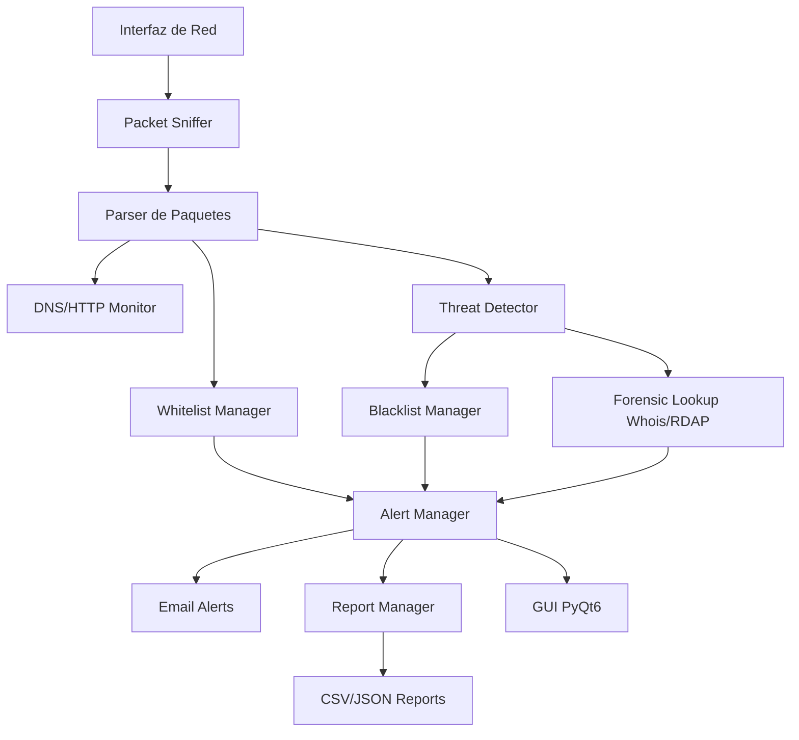

# Proyecto-de-Seguridad

# PROMPT MAESTRO PARA CODEX

## Proyecto: IDS Institucional en Linux Debian con GUI, Backend Modular, Alertas, Reportes y Documentación

Quiero que desarrolles un proyecto real, funcional, modular y escalable llamado:

**IDS Institucional**

Debe ejecutarse en **Linux Debian** y estar desarrollado en **Python 3**, usando una arquitectura limpia separada en backend, interfaz gráfica, configuración, reportes, logs, documentación y pruebas.

El sistema debe funcionar como un IDS defensivo para una red local autorizada. No debe incluir funciones ofensivas, explotación, evasión, robo de credenciales ni acciones destructivas. Todo debe estar orientado a monitoreo, auditoría, alertas y generación de reportes.

El proyecto debe cumplir con estos módulos principales:

1. Lista blanca de IPs y MACs autorizadas.
2. Detección de dispositivos no autorizados en red.
3. Monitoreo de tráfico DNS y HTTP.
4. Registro de dominios visitados.
5. Detección de IPs peligrosas usando lista negra local y opcionalmente API externa.
6. Consulta forense Whois/RDAP/Abuse para IPs peligrosas.
7. Envío de alertas por correo SMTP.
8. Protección de credenciales mediante archivo `.env`.
9. Interfaz gráfica con pestañas.
10. Reportes CSV/JSON.
11. Logs del sistema.
12. Manual de usuario.
13. Documentación técnica.
14. Análisis jurídico básico para México.
15. Pruebas unitarias básicas.

Usa esta estructura base del proyecto:

```text
ids_institucional/
│
├── main.py
├── requirements.txt
├── .env.example
├── README.md
│
├── app/
│   ├── __init__.py
│   ├── core/
│   │   ├── packet_sniffer.py
│   │   ├── whitelist_manager.py
│   │   ├── blacklist_manager.py
│   │   ├── dns_http_monitor.py
│   │   ├── threat_detector.py
│   │   ├── forensic_lookup.py
│   │   ├── email_alerts.py
│   │   ├── report_manager.py
│   │   └── logger_manager.py
│   │
│   ├── gui/
│   │   ├── main_window.py
│   │   ├── dashboard_tab.py
│   │   ├── whitelist_tab.py
│   │   ├── traffic_tab.py
│   │   ├── alerts_tab.py
│   │   ├── reports_tab.py
│   │   └── settings_tab.py
│   │
│   ├── config/
│   │   ├── settings.py
│   │   ├── whitelist_ips.txt
│   │   ├── whitelist_macs.txt
│   │   └── blacklist_ips.json
│   │
│   ├── data/
│   │   ├── logs/
│   │   ├── reports/
│   │   └── exports/
│   │
│   └── utils/
│       ├── validators.py
│       ├── network_utils.py
│       └── file_utils.py
│
├── docs/
│   ├── manual_usuario.md
│   ├── documentacion_tecnica.md
│   ├── analisis_juridico_mexico.md
│   ├── troubleshooting.md
│   └── arquitectura.md
│
└── tests/
    ├── test_whitelist.py
    ├── test_blacklist.py
    ├── test_validators.py
    └── test_reports.py
```

---

# FASE 1 — BASE DEL PROYECTO, ARQUITECTURA, CONFIGURACIÓN SEGURA Y GUI INICIAL

Desarrolla la primera versión funcional del proyecto IDS Institucional.

## Objetivo de la fase

Crear la base completa del proyecto con estructura modular, configuración segura, interfaz gráfica inicial con pestañas y módulos base conectados aunque todavía no tengan toda la lógica avanzada.

## Requisitos técnicos

Usa Python 3 en Linux Debian.

Usa estas librerías principales:

```bash
PyQt6
scapy
python-dotenv
requests
ipwhois
pandas
```

Genera el archivo `requirements.txt`.

El proyecto debe ejecutarse con:

```bash
python3 main.py
```

Debe validar que el usuario tenga permisos suficientes para capturar paquetes. Si no se ejecuta con permisos adecuados, mostrar mensaje claro indicando que se use:

```bash
sudo python3 main.py
```

## Interfaz gráfica

Crea una GUI con PyQt6 usando `QMainWindow` y `QTabWidget`.

Debe tener estas pestañas:

1. **Dashboard**

   * Estado del IDS.
   * Interfaz de red seleccionada.
   * Total de paquetes capturados.
   * Total de alertas.
   * Total de dispositivos no autorizados.
   * Botón iniciar monitoreo.
   * Botón detener monitoreo.

2. **Lista Blanca**

   * Tabla de IPs autorizadas.
   * Tabla de MACs autorizadas.
   * Formulario para agregar IP.
   * Formulario para agregar MAC.
   * Botón eliminar seleccionado.
   * Botón guardar cambios.

3. **Tráfico**

   * Tabla en tiempo real con:

     * Fecha y hora.
     * IP origen.
     * MAC origen.
     * IP destino.
     * Protocolo.
     * Dominio detectado si existe.
     * Estado: autorizado, sospechoso o peligroso.

4. **Alertas**

   * Tabla con alertas generadas.
   * Nivel: bajo, medio, alto, emergencia.
   * Descripción.
   * IP/MAC involucrada.
   * Fecha y hora.
   * Estado del correo enviado.

5. **Reportes**

   * Botón exportar CSV.
   * Botón exportar JSON.
   * Vista de resumen.
   * Total de dominios visitados.
   * Total de IPs peligrosas detectadas.
   * Total de dispositivos no autorizados.

6. **Configuración**

   * Campo para correo del administrador.
   * Campo para servidor SMTP.
   * Campo para puerto SMTP.
   * Campo para usuario SMTP.
   * Campo para activar/desactivar TLS.
   * Botón guardar configuración.
   * Importante: no mostrar ni guardar contraseña en código duro.

## Configuración segura

Crear archivo `.env.example` con:

```env
ADMIN_EMAIL=admin@example.com
SMTP_SERVER=smtp.example.com
SMTP_PORT=587
SMTP_USER=user@example.com
SMTP_PASSWORD=change_me
SMTP_USE_TLS=true
NETWORK_INTERFACE=eth0
ENABLE_EMAIL_ALERTS=false
```

Crear `settings.py` para cargar variables con `python-dotenv`.

Nunca hardcodear contraseñas.

## Backend mínimo funcional

Crear estas clases:

### `WhitelistManager`

Funciones:

```python
load_ips()
load_macs()
is_ip_allowed(ip)
is_mac_allowed(mac)
add_ip(ip)
add_mac(mac)
remove_ip(ip)
remove_mac(mac)
save()
```

Debe leer desde:

```text
app/config/whitelist_ips.txt
app/config/whitelist_macs.txt
```

### `BlacklistManager`

Debe leer `blacklist_ips.json` con esta estructura:

```json
[
  {
    "ip": "192.0.2.10",
    "risk": "Botnet",
    "severity": "high",
    "description": "IP asociada a actividad maliciosa de prueba"
  }
]
```

Funciones:

```python
load_blacklist()
is_blacklisted(ip)
get_risk_info(ip)
```

### `ReportManager`

Debe poder guardar eventos en CSV y JSON.

Eventos mínimos:

```python
{
  "timestamp": "...",
  "src_ip": "...",
  "src_mac": "...",
  "dst_ip": "...",
  "protocol": "...",
  "domain": "...",
  "status": "authorized/suspicious/dangerous",
  "description": "..."
}
```

### `LoggerManager`

Crear logs en:

```text
app/data/logs/ids.log
```

## Documentación inicial

Crear:

```text
README.md
docs/manual_usuario.md
docs/documentacion_tecnica.md
docs/troubleshooting.md
docs/arquitectura.md
```

El README debe explicar:

* Qué es el sistema.
* Cómo instalarlo en Debian.
* Cómo crear entorno virtual.
* Cómo instalar dependencias.
* Cómo ejecutar.
* Por qué se usa `.env`.

## Resultado esperado de la fase 1

El proyecto debe abrir una interfaz gráfica funcional con pestañas, permitir administrar listas blancas, cargar configuración desde `.env`, guardar logs y generar reportes básicos aunque todavía no capture tráfico real completo.

---

# FASE 2 — CAPTURA DE PAQUETES, LISTAS BLANCAS CAPA 2/3 Y MONITOREO DNS/HTTP

Continúa sobre el proyecto ya creado.

## Objetivo de la fase

Implementar captura real de tráfico de red con Scapy, validar IP/MAC contra listas blancas, detectar dispositivos no autorizados y registrar tráfico DNS/HTTP en tiempo real dentro de la GUI.

## Requisitos técnicos

Implementar `packet_sniffer.py` usando Scapy.

La captura debe ejecutarse en un hilo separado para no congelar la interfaz gráfica.

Usa `QThread` o `threading.Thread` de forma segura.

La GUI debe actualizar tablas en tiempo real usando señales de PyQt6.

## Funcionalidad de captura

El IDS debe capturar paquetes de la interfaz definida en `.env`:

```env
NETWORK_INTERFACE=wlan0
```

Si la interfaz no existe, mostrar error claro en la pestaña Dashboard.

Debe detectar:

* IP origen.
* IP destino.
* MAC origen.
* MAC destino.
* Protocolo.
* Consultas DNS.
* Dominios visitados.
* Intentos HTTP básicos.

## Validación de lista blanca

Para cada paquete:

1. Obtener IP origen.
2. Obtener MAC origen.
3. Revisar si la IP está autorizada.
4. Revisar si la MAC está autorizada.
5. Si IP o MAC no están autorizadas:

   * Crear alerta.
   * Registrar evento.
   * Mostrar en pestaña Alertas.
   * Marcar tráfico como `suspicious`.
   * Enviar correo si `ENABLE_EMAIL_ALERTS=true`.

## Monitoreo DNS

Detectar paquetes DNS con Scapy.

Cuando un usuario consulte un dominio, guardar:

* Fecha y hora.
* IP origen.
* MAC origen.
* Dominio consultado.
* IP destino.
* Protocolo DNS.
* Estado.

Mostrar estos datos en la pestaña Tráfico.

## Monitoreo HTTP

Detectar tráfico hacia puertos 80 y 8080.

Guardar:

* IP origen.
* IP destino.
* Puerto destino.
* Protocolo HTTP.
* Dominio si puede obtenerse.
* Estado.

No intentar romper HTTPS ni descifrar tráfico.

## Alertas

Crear un modelo de alerta con:

```python
{
  "timestamp": "...",
  "level": "medium",
  "type": "Unauthorized Device",
  "src_ip": "...",
  "src_mac": "...",
  "description": "Dispositivo no registrado generó tráfico en la red",
  "email_sent": false
}
```

## Email

Implementar `email_alerts.py`.

Funciones:

```python
send_alert_email(subject, body)
send_unauthorized_device_alert(alert)
send_dangerous_ip_alert(alert)
```

Debe usar SMTP con datos del `.env`.

Debe manejar errores comunes:

* Credenciales incorrectas.
* Servidor SMTP no disponible.
* Puerto incorrecto.
* TLS fallido.
* Correo enviado a spam.

Nunca imprimir contraseña en logs.

## GUI

Actualizar:

### Dashboard

Mostrar:

* IDS activo/inactivo.
* Paquetes capturados.
* Alertas generadas.
* Último dominio detectado.
* Última alerta.

### Tráfico

Actualizar tabla en tiempo real.

### Alertas

Actualizar tabla en tiempo real.

### Lista Blanca

Permitir agregar IP/MAC sin reiniciar el programa.

## Resultado esperado de la fase 2

El IDS debe capturar tráfico real, mostrar paquetes en la GUI, detectar dispositivos no autorizados por IP/MAC, registrar dominios DNS consultados y generar alertas visuales y por correo.

---

# FASE 3 — THREAT INTELLIGENCE, IPs PELIGROSAS, WHOIS/ABUSE Y AUTOMATIZACIÓN FORENSE

Continúa sobre el proyecto ya creado.

## Objetivo de la fase

Agregar detección de IPs peligrosas, consulta forense automática y generación de alertas de emergencia con información útil para reportar abuso.

## Lista negra local

Mejorar `blacklist_ips.json` para incluir:

```json
[
  {
    "ip": "203.0.113.55",
    "risk": "Botnet",
    "severity": "critical",
    "description": "IP asociada a red de bots",
    "source": "Local test blacklist"
  },
  {
    "ip": "198.51.100.23",
    "risk": "Malware",
    "severity": "high",
    "description": "IP asociada a distribución de malware",
    "source": "Local test blacklist"
  }
]
```

Cuando el IDS detecte conexión hacia una IP de la blacklist:

1. Marcar evento como `dangerous`.
2. Crear alerta nivel `emergency`.
3. Consultar información forense.
4. Enviar correo de emergencia al administrador.
5. Guardar reporte en CSV/JSON.
6. Mostrar alerta en GUI.

## Threat Detector

Crear `threat_detector.py`.

Funciones:

```python
analyze_packet(packet_data)
check_dangerous_ip(ip)
create_threat_alert(packet_data, risk_info)
```

Debe analizar IP origen e IP destino.

## Consulta Whois/RDAP/Abuse

Crear `forensic_lookup.py`.

Usar `ipwhois`.

Funciones:

```python
lookup_ip(ip)
extract_abuse_contacts(result)
generate_forensic_summary(ip)
```

El resumen debe incluir:

* IP detectada.
* ASN.
* Organización.
* País.
* Contacto abuse si existe.
* Fuente de datos.
* Riesgo detectado.
* Fecha y hora.

Si no encuentra contacto abuse, debe indicarlo claramente.

## Correo de emergencia

El correo debe tener asunto:

```text
[IDS ALERTA EMERGENCIA] IP peligrosa detectada
```

El cuerpo debe incluir:

```text
Fecha/Hora:
IP origen:
MAC origen:
IP peligrosa:
Riesgo:
Severidad:
Descripción:
ASN:
Organización:
País:
Contacto Abuse:
Recomendación:
```

La recomendación debe ser defensiva, por ejemplo:

```text
Revisar el equipo origen, validar si el tráfico fue autorizado, bloquear la IP en firewall y reportar al contacto de abuso si aplica.
```

## Pestaña Alertas

Agregar filtros:

* Todas.
* Bajo.
* Medio.
* Alto.
* Emergencia.

Agregar botón:

```text
Ver detalle forense
```

Al seleccionar una alerta peligrosa, mostrar ventana modal con el resumen Whois/Abuse.

## Pestaña Reportes

Agregar:

* Exportar reporte de tráfico.
* Exportar reporte de alertas.
* Exportar reporte forense.
* Generar resumen ejecutivo.

El resumen ejecutivo debe incluir:

* Total paquetes capturados.
* Total dominios detectados.
* Top 10 dominios.
* IPs peligrosas detectadas.
* Dispositivos no autorizados.
* Recomendaciones.

## Seguridad

Agregar validaciones:

* Validar formato IP.
* Validar formato MAC.
* Evitar archivos corruptos.
* Manejar errores de red.
* Manejar errores de permisos.
* Manejar errores de SMTP.
* Manejar errores de Whois.

## Resultado esperado de la fase 3

El IDS debe detectar conexiones hacia IPs peligrosas, generar alertas de emergencia, consultar información forense Whois/Abuse, enviar correos detallados y permitir revisar la información desde la GUI.

---

# FASE 4 — DOCUMENTACIÓN COMPLETA, MANUAL, ANÁLISIS JURÍDICO, PRUEBAS, EMPAQUETADO Y PULIDO FINAL

Continúa sobre el proyecto ya creado.

## Objetivo de la fase

Dejar el proyecto listo para entrega escolar presencial, con documentación completa, manual de usuario, troubleshooting, análisis jurídico, pruebas y mejoras visuales.

## Documentación requerida

Completar los siguientes archivos:

```text
docs/manual_usuario.md
docs/documentacion_tecnica.md
docs/troubleshooting.md
docs/analisis_juridico_mexico.md
docs/arquitectura.md
README.md
```

## Manual de usuario

Debe incluir:

1. Introducción.
2. Objetivo del IDS.
3. Sistema operativo recomendado: Linux Debian.
4. Requisitos:

   * Python 3.
   * pip.
   * venv.
   * libpcap.
   * permisos sudo.
   * conexión de red.
   * cuenta SMTP.
5. Instalación paso a paso:

```bash
sudo apt update
sudo apt install python3 python3-pip python3-venv tcpdump libpcap-dev
python3 -m venv venv
source venv/bin/activate
pip install -r requirements.txt
cp .env.example .env
sudo python3 main.py
```

6. Cómo configurar `.env`.
7. Cómo seleccionar interfaz de red.
8. Cómo dar de alta IP en lista blanca.
9. Cómo dar de alta MAC en lista blanca.
10. Cómo iniciar monitoreo.
11. Cómo detener monitoreo.
12. Cómo interpretar tráfico.
13. Cómo interpretar alertas.
14. Cómo exportar reportes.
15. Qué hacer si el correo llega a spam.
16. Capturas de pantalla simuladas o espacios marcados para capturas reales.

## Troubleshooting

Incluir tabla con:

| Problema            | Causa probable         | Solución                              |
| ------------------- | ---------------------- | ------------------------------------- |
| No captura paquetes | No se ejecutó con sudo | Ejecutar sudo python3 main.py         |
| No aparece interfaz | Nombre incorrecto      | Usar ip link                          |
| No envía correos    | SMTP mal configurado   | Revisar .env                          |
| Correo llega a spam | Servidor no confiable  | Revisar SPF/DKIM o marcar como seguro |
| Error de permisos   | Falta sudo             | Ejecutar con privilegios              |
| Error con PyQt6     | Dependencia faltante   | Reinstalar requirements               |

## Documentación técnica

Debe explicar:

* Arquitectura del sistema.
* Separación frontend/backend.
* Flujo de captura.
* Flujo de detección.
* Flujo de alertas.
* Flujo de reportes.
* Modelo OSI:

  * Capa 2: MAC.
  * Capa 3: IP.
  * Capa 7: DNS/HTTP.
* Protección de credenciales.
* Uso de `.env`.
* Logs.
* Reportes.

## Diagrama de arquitectura

Crear un archivo `docs/arquitectura.md` con un diagrama Mermaid:



## Análisis jurídico México

Crear `docs/analisis_juridico_mexico.md`.

Debe explicar de forma escolar y clara:

* El monitoreo debe aplicarse únicamente en infraestructura propia o autorizada.
* Debe existir aviso o política interna de uso de red.
* El monitoreo debe tener finalidad de seguridad.
* Las bitácoras pueden contener datos personales si identifican usuarios, IPs, MACs o hábitos de navegación.
* Se debe considerar la Ley Federal de Protección de Datos Personales en Posesión de los Particulares.
* Se debe limitar el acceso a logs.
* Se debe definir tiempo de conservación.
* Se debe informar a usuarios mediante política interna.
* No se debe usar para espionaje personal.
* Incluir política sugerida de uso aceptable y monitoreo de red.

## Pruebas

Crear pruebas con `pytest`.

Agregar tests para:

```text
test_whitelist.py
test_blacklist.py
test_validators.py
test_reports.py
```

Las pruebas deben verificar:

* IP válida.
* IP inválida.
* MAC válida.
* MAC inválida.
* IP autorizada.
* MAC autorizada.
* IP en blacklist.
* Exportación CSV.
* Exportación JSON.

## Mejoras visuales

Pulir la GUI:

* Título profesional.
* Tablas ordenadas.
* Botones claros.
* Mensajes de estado.
* Indicadores de color visual:

  * Verde: autorizado.
  * Amarillo: sospechoso.
  * Rojo: peligroso.
* Sin saturar la interfaz.
* Todo debe ser entendible para presentación presencial.

## Empaquetado final

Agregar script `run.sh`:

```bash
#!/bin/bash
source venv/bin/activate
sudo python3 main.py
```

Agregar permisos:

```bash
chmod +x run.sh
```

Agregar en README cómo ejecutarlo.

## Resultado esperado de la fase 4

El proyecto debe quedar listo para entrega con:

* IDS funcional.
* GUI por pestañas.
* Captura real.
* Listas blancas.
* Monitoreo DNS/HTTP.
* Detección de IPs peligrosas.
* Whois/Abuse.
* Correos.
* Reportes.
* Logs.
* Manual de usuario.
* Documentación técnica.
* Análisis jurídico.
* Troubleshooting.
* Pruebas.
* README completo.

Antes de finalizar, revisa todo el proyecto y corrige errores de importación, rutas relativas, permisos, dependencias y fallos comunes en Linux Debian.

